# 🍔 HUNGRY - Food Delivery App

<div align="center">
  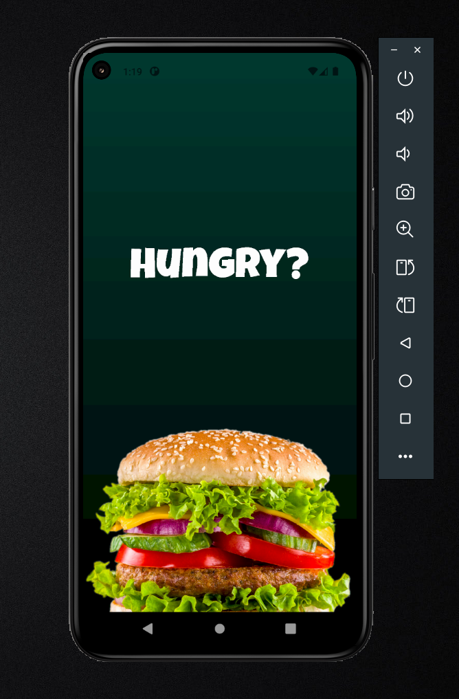
  
  [](https://flutter.dev/)
  [](https://dart.dev/)
  
  **A modern, feature-rich food delivery application built with Flutter**
</div>

---

## 📖 About The Project

**HUNGRY** is a comprehensive food delivery mobile application that allows users to browse delicious food items, customize their orders, manage their cart, and complete purchases seamlessly. The app features an intuitive user interface with smooth navigation and a delightful user experience.

### ✨ Key Features

- 🔐 **User Authentication** - Secure signup and login system
- 🏠 **Home Dashboard** - Browse food categories and popular items
- 🍕 **Product Customization** - Customize burgers with toppings and sides
- 🛒 **Shopping Cart** - Add, remove, and manage order quantities
- 💳 **Multiple Payment Methods** - Cash on delivery and debit card options
- 📦 **Order History** - Track past orders and reorder with ease
- 👤 **User Profile** - Manage personal information and payment methods
- 🎨 **Beautiful UI/UX** - Clean, modern design with smooth animations

---

## 📱 App Screenshots

### Authentication Flow
<div align="center">
  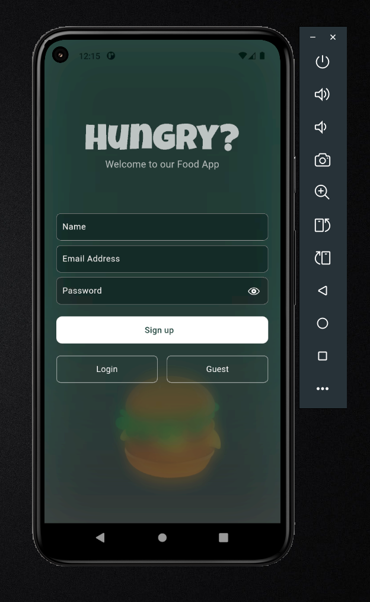
  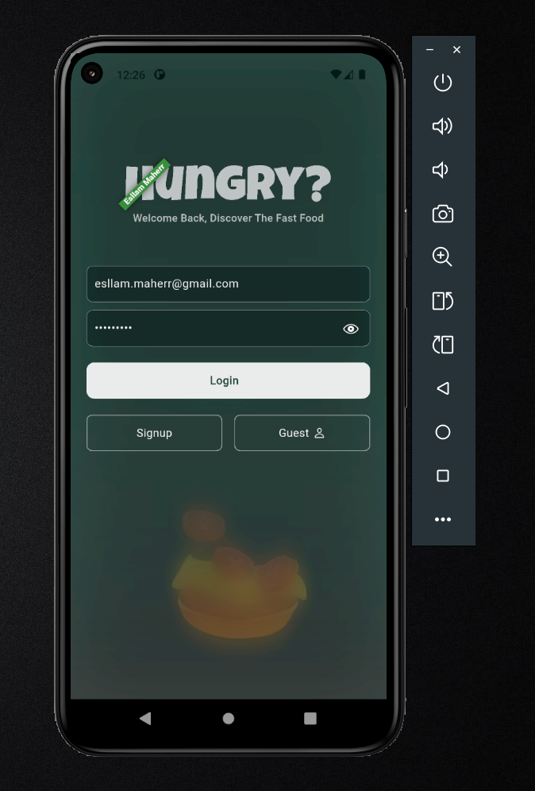
</div>

**User Registration & Login**
- Clean, minimalist authentication interface
- Email and password validation
- Guest mode option for quick browsing
- Secure credential management

---

### Home & Browse
<div align="center">
  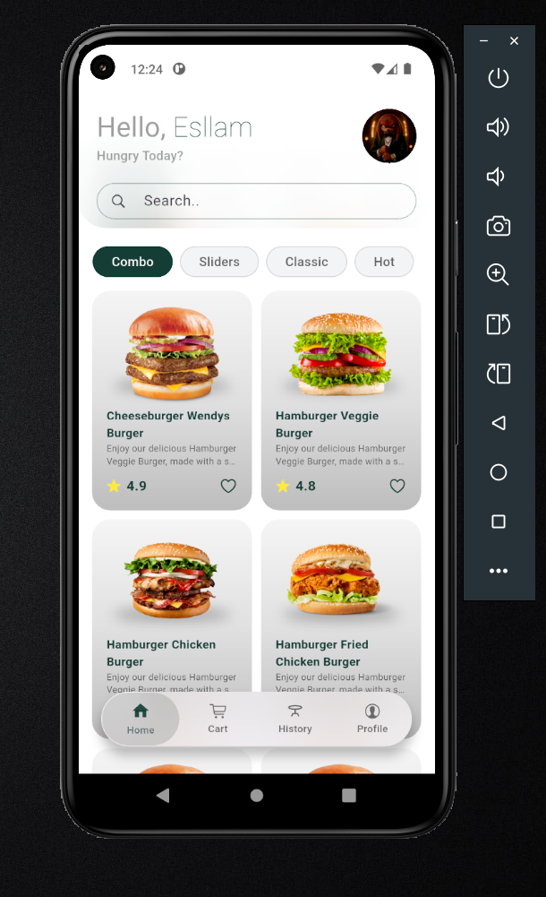
  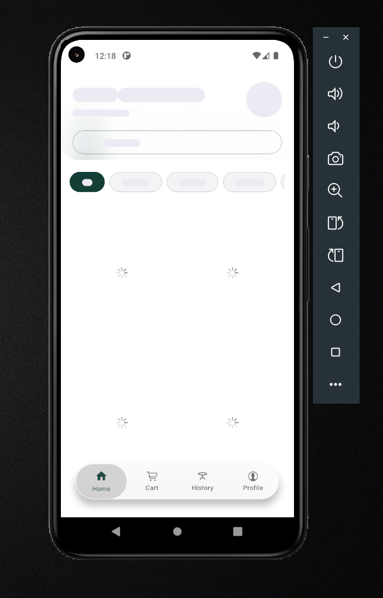
</div>

**Food Discovery**
- Personalized greeting with user name
- Search functionality for quick item lookup
- Category filters (Combo, Sliders, Classic, Hot)
- Food item cards with ratings and descriptions
- Skeleton loading states for better UX

---

### Product Customization
<div align="center">
  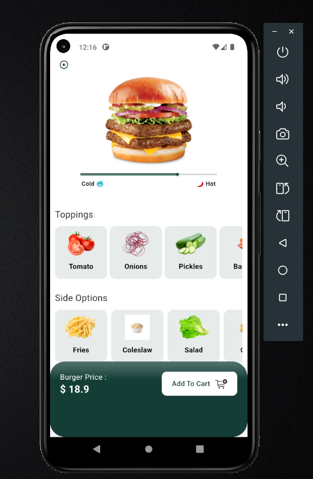
</div>

**Detailed Product View**
- High-quality food images
- Temperature preference slider (Cold/Hot)
- Interactive topping selection (Tomato, Onions, Pickles, Bacon)
- Side options (Fries, Coleslaw, Salad)
- Real-time price calculation
- Add to cart functionality

---

### Shopping Cart
<div align="center">
  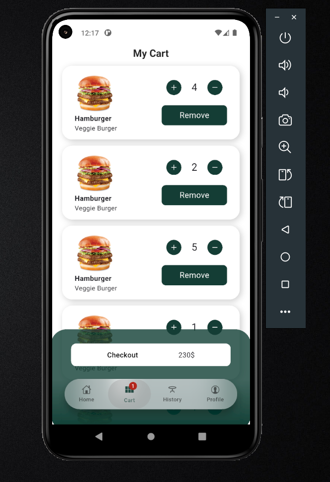
</div>

**Cart Management**
- Visual product display with thumbnails
- Quantity adjustment controls (+/-)
- Individual item removal
- Real-time total calculation
- Seamless checkout process
- Bottom navigation for easy access

---

### Checkout & Payment
<div align="center">
  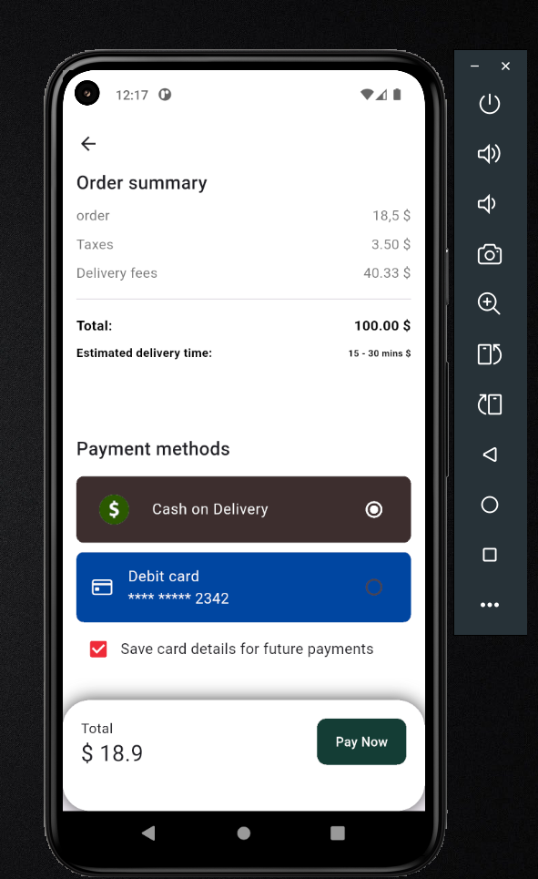
  
</div>

**Order Summary & Payment**
- Detailed cost breakdown (Order, Taxes, Delivery fees)
- Estimated delivery time
- Multiple payment options:
  - Cash on Delivery
  - Debit Card (with card details masked)
- Save card option for future payments
- Success confirmation modal

---

### Order History
<div align="center">
  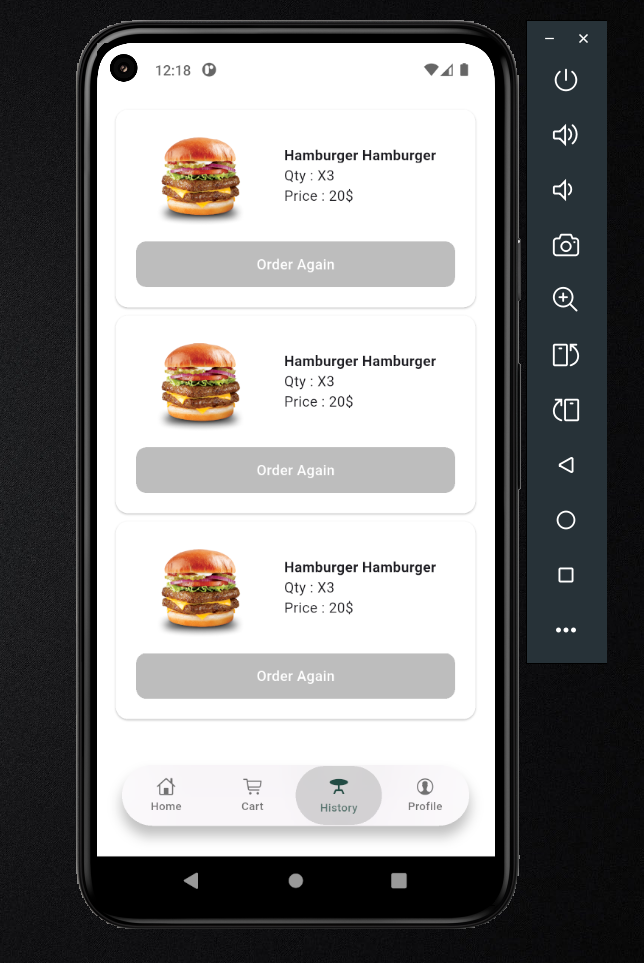
</div>

**Past Orders**
- Complete order history
- Product details with quantities and prices
- One-tap reorder functionality
- Easy access via bottom navigation

---

### User Profile
<div align="center">
  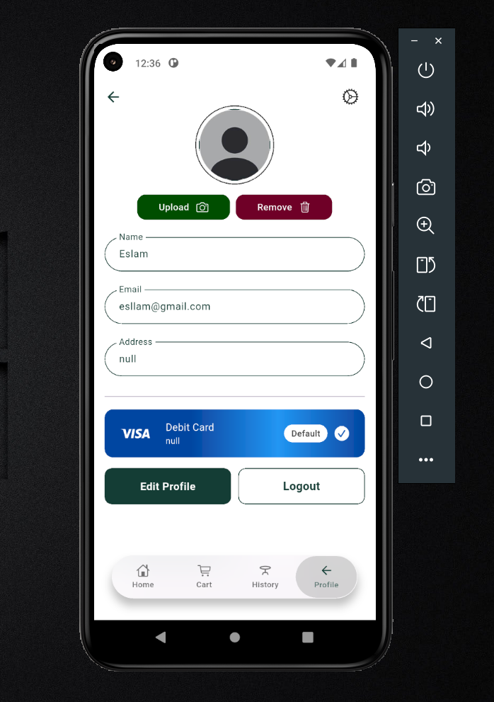
  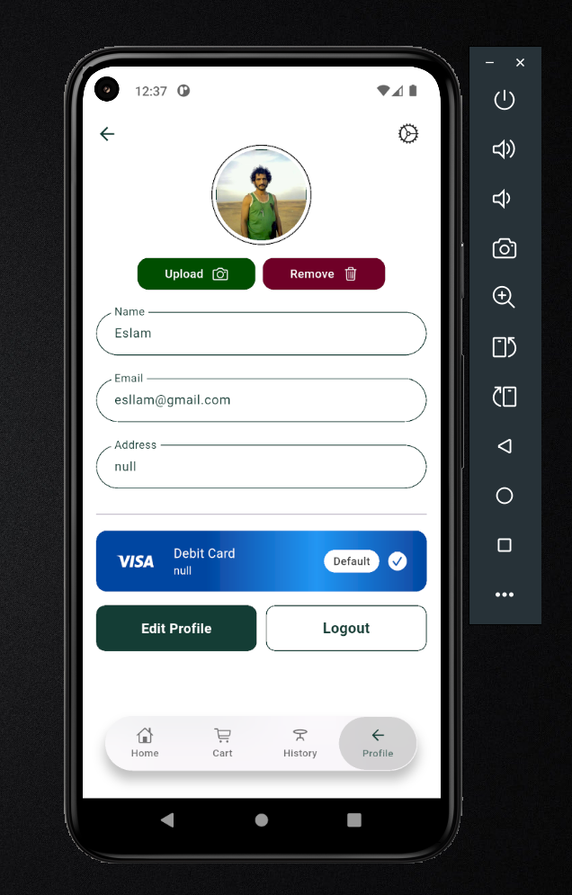
</div>

**Profile Management**
- Profile picture upload/removal
- Personal information editing (Name, Email, Address)
- Saved payment method management
- Edit profile and logout options
- Settings access

---

## 🛠️ Built With

- **[Flutter](https://flutter.dev/)** - UI framework for building natively compiled applications
- **[Dart](https://dart.dev/)** - Programming language optimized for building mobile apps
- **Material Design** - Google's design system for intuitive interfaces

### 📦 Dependencies

```yaml
dependencies:
  flutter:
    sdk: flutter
  gap: ^3.0.1
  dio: ^5.9.0
  shared_preferences: ^2.5.3
  get_it: ^7.6.4
  google_fonts: ^6.1.0
  go_router: ^16.0.0
  dartz: ^0.10.1
  quickalert: ^1.1.0
  url_launcher: ^6.2.4
  ionicons: ^0.2.2
  font_awesome_flutter: ^10.6.0
  flutter_screenutil: ^5.9.3
  equatable: ^2.0.7
  flutter_svg: ^2.2.1
  flutter_bloc: ^9.1.1
  cached_network_image: ^3.4.1
  skeletonizer: ^2.1.1
```

---

## 🚀 Getting Started

### Prerequisites

- Flutter SDK (latest stable version)
- Dart SDK
- Android Studio / VS Code with Flutter extensions
- Android Emulator or iOS Simulator / Physical Device

### Installation

1. **Clone the repository**
   ```bash
   git clone https://github.com/Esllam18/hungry.git
   cd hungry
   ```

2. **Install dependencies**
   ```bash
   flutter pub get
   ```

3. **Run the app**
   ```bash
   flutter run
   ```

### Build for Release

**Android APK**
```bash
flutter build apk --release
```

**iOS**
```bash
flutter build ios --release
```

---

## 📁 Project Structure

```
hungry/
├── assets/
│   ├── screens/          # App screenshots
│   └── images/           # App images and icons
├── lib/
│   ├── models/           # Data models
│   ├── screens/          # UI screens
│   ├── widgets/          # Reusable widgets
│   ├── services/         # API and business logic
│   └── main.dart         # App entry point
├── pubspec.yaml          # Project dependencies
└── README.md             # This file
```

---

## 🎯 Features Breakdown

### 1. Authentication System
- User registration with email validation
- Secure login mechanism
- Guest mode for browsing without account
- Password visibility toggle

### 2. Food Browsing
- Category-based filtering
- Search functionality
- Product ratings and reviews
- Smooth scrolling experience

### 3. Order Customization
- Visual topping selection
- Temperature preferences
- Side dish options
- Price updates in real-time

### 4. Cart Management
- Add/remove items
- Quantity adjustment
- Price calculation
- Persistent cart state

### 5. Checkout Process
- Order summary with breakdown
- Multiple payment methods
- Delivery time estimation
- Order confirmation

### 6. User Profile
- Profile picture management
- Personal information editing
- Payment method storage
- Order history access

---

## 🎨 UI/UX Highlights

- **Color Scheme**: Dark green primary color with white accents
- **Typography**: Clean, readable fonts with proper hierarchy
- **Icons**: Lucide icons for consistent visual language
- **Animations**: Smooth transitions between screens
- **Responsive**: Adapts to different screen sizes
- **Loading States**: Skeleton screens for better perceived performance

---

## 🔮 Future Enhancements

- [ ] Real-time order tracking
- [ ] Push notifications
- [ ] Multiple language support
- [ ] Restaurant ratings and reviews
- [ ] Favorites/Wishlist functionality
- [ ] Promotional codes and discounts
- [ ] Social media integration
- [ ] Live chat support

---

## 🤝 Contributing

Contributions are welcome! Here's how you can help:

1. Fork the project
2. Create your feature branch (`git checkout -b feature/AmazingFeature`)
3. Commit your changes (`git commit -m 'Add some AmazingFeature'`)
4. Push to the branch (`git push origin feature/AmazingFeature`)
5. Open a Pull Request

---

## 📝 License

This project is open source and available under the [MIT License](LICENSE).

---

## 👨‍💻 Developer

**Esllam**

- GitHub: [@Esllam18](https://github.com/Esllam18)
- Email: esllam.maherr@gmail.com

---

## 🙏 Acknowledgments

- Flutter team for the amazing framework
- Material Design for design guidelines
- All contributors and testers

---

<div align="center">
  <p>Made with ❤️ and Flutter</p>
  <p>⭐ Star this repository if you find it helpful!</p>
</div>
